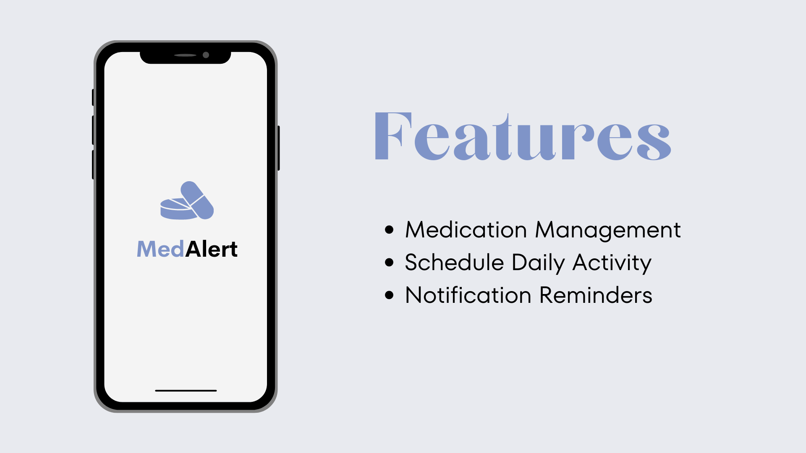
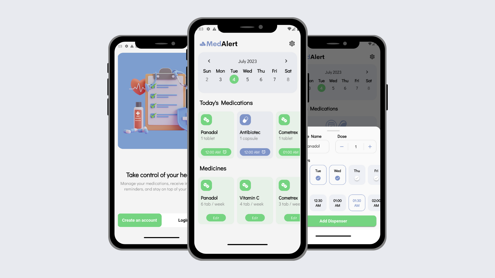
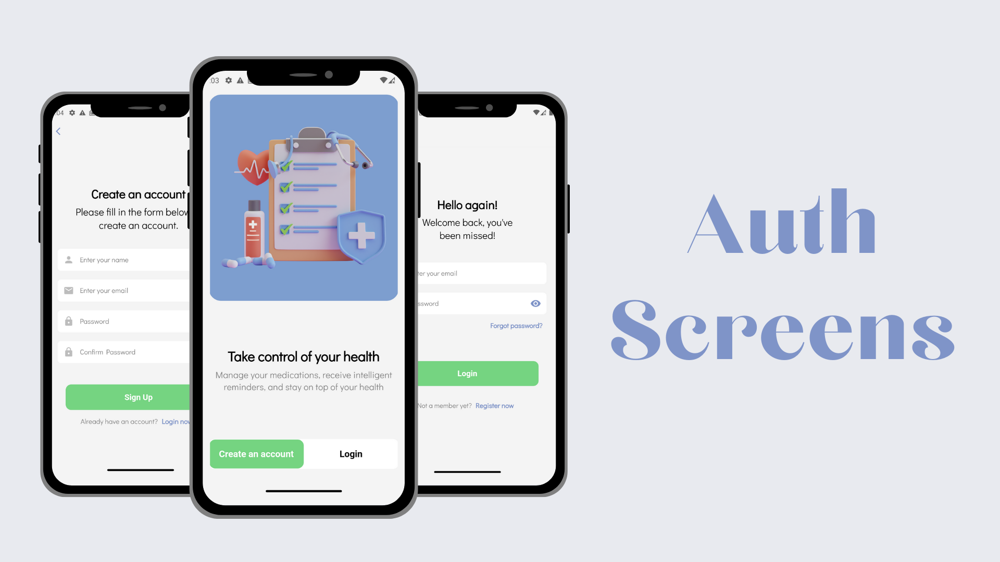
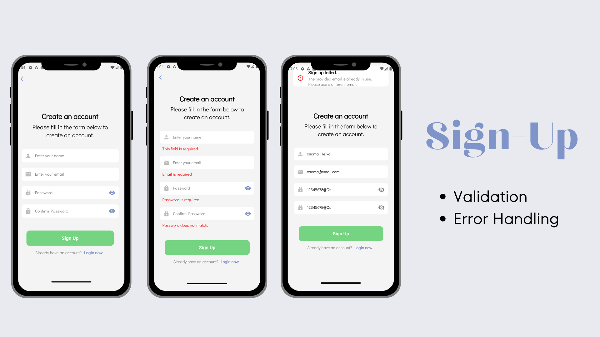
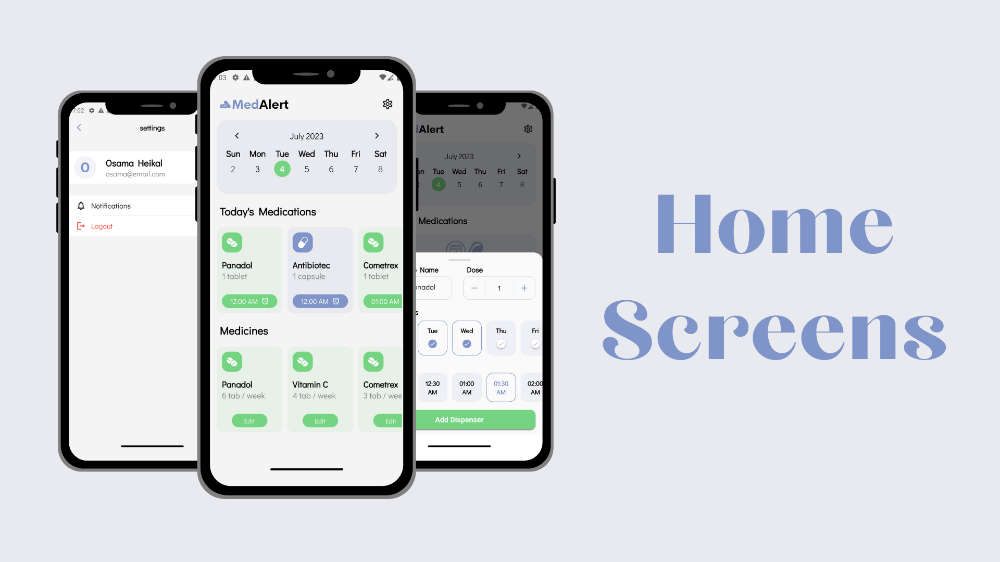
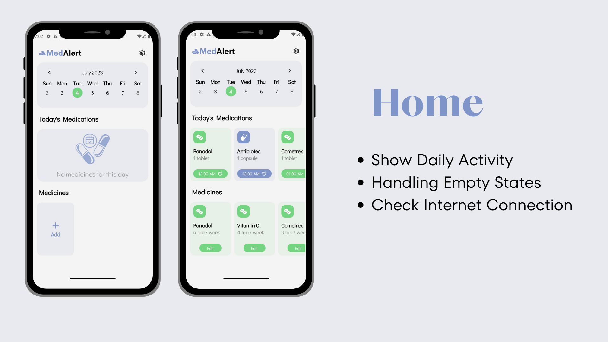
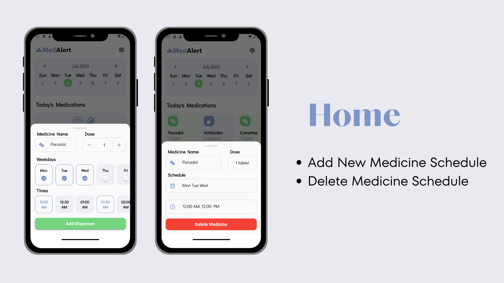

# MedAlert

MedAlert is a simple Flutter application designed to help users manage their medications efficiently. With MedAlert, users can add medication information, set schedules, and receive notifications as reminders.

## Screenshots









## Features

- **Medication Management**: Users can easily add and manage their medication information, including dosage, schedule, and any additional notes.
- **Weekly Activity**: The app provides users with a convenient weekly overview of their medication activity, allowing them to track their progress and adherence.
- **Notification Reminders**: MedAlert sends timely notifications to remind users to take their medications according to their specified schedules.

## Technologies Used

- **Firebase Auth**: Firebase Authentication is integrated into MedAlert for secure user authentication and authorization.
- **Firebase Firestore**: MedAlert utilizes Firebase Firestore as its database solution to store and retrieve medication data.
- **Flutter Local Notification**: The [Flutter Local Notification](https://pub.dev/packages/flutter_local_notifications) package is employed for scheduling and delivering notifications to users.
- **Go Router**: Go Router is used for efficient routing within the application, enabling seamless navigation between screens.
- **Dartz**: Dartz library aids in handling errors effectively, ensuring a robust user experience.
- **Flutter Screen Utils**: MedAlert utilizes Flutter Screen Utils to create a responsive user interface across various screen sizes.
- **Get It**: Get It serves as a service locator to manage dependencies within the app.
- **BLoC**: BLoC (Business Logic Component) is adopted as the state management solution for MedAlert, facilitating separation of concerns and maintainability.
- **Clean Code Architecture**: MedAlert follows the Clean Code architecture pattern, promoting code organization, testability, and maintainability.

## Installation

To run MedAlert locally, follow these steps:

1. Clone the repository:
   ```shell
   git clone [repository-url]
